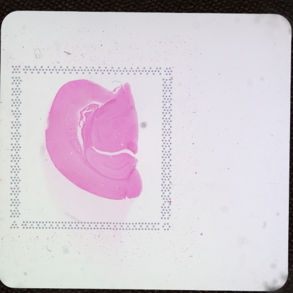
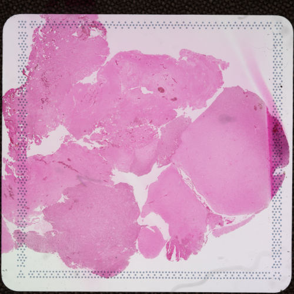
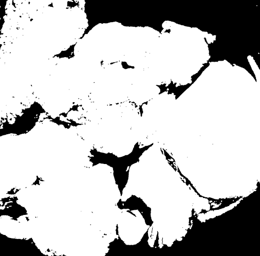

# cytassist_estimate_reads
Automatically estimate the number of sequencing reads for 10x Visium CytAssist experiments according to their tissue image.


## About

This short script is meant to streamline estimation of required sequencing reads for 10x Visium for CytAssist experiments. The idea is to remove bias from manual estimation by consistently and repeatedly using the same algorithm based on the CytAssist's tissue images along with tunable parameters. Once all your samples have been processed, all your data is collected in a ```tsv``` file ready for preparing sequencing quotes and loading concentrations, etc.

## Installation

1. Clone this repository or download [cytassist_estimate_reads.py](./cytassist_estimate_reads.py).
1. Use your package manager of choice to install the following requirements:
    * [Python 3.9](https://www.python.org/downloads/release/python-390/)
    * [numpy](https://numpy.org/install/)
    * [pandas](https://pandas.pydata.org/docs/getting_started/install.html)
    * [matplotlib](https://matplotlib.org/stable/users/installing/index.html)
    * [scikit-image](https://scikit-image.org/docs/stable/install.html)

## Usage

1. Open a terminal with the correct python environment.
1. Run ```cytassist_estimate_reads.py``` with at least the two required options:
    ```bash
        -i INPUT, --input INPUT
                            Input CytAssist image. Required.
        -o OUTPUT, --output OUTPUT
                            Output directory Default: [./]
    ```
    * ```input``` must be a ```.tif``` or ```.png``` image generated from the 10x Cytassist instrument.
    * ```output``` can be a directory or a correctly formatted ```.tsv``` file (i.e. from a previously processed image). If a file is given, the parent directory will be used to export the tissue masks. If nothing is given, output directory will be the current working directory.
1. If necessary, users can include the following optional parameters:
    ```bash
        -r READS_PER_SPOT, --reads_per_spot READS_PER_SPOT
                        Desired number of reads per spot. Default: [25000]
        -s {6.5mm,11mm}, --slide_type {6.5mm,11mm}
                        Total number of spots available. Default: [6.5mm]
        -t THRESHOLD, --threshold THRESHOLD
                                Thresholding value for foreground mask. Default: [Otsu]
        -v, --verbose  Print updates and reports as program executes. Provide the following number of "v" for the corresponding settings: [Default: Error, v: Warning, vv: Info, vvv: Debug]
    ```
    * ```reads_per_spot``` can be adjusted for increased read depth. Default value is the minimum recommended settings by 10x.
    * ```slide_type``` determines the parameters for trimming the Visium capture area and setting total number of capture dots. Default value is set for 6.5mm slides, but must be adjusted for 11mm slides.
    * ```threshold``` is the numeric threshold for selecting the foreground tissue image (from grayscale). If none is given, [Otsu's thresholding](https://scikit-image.org/docs/dev/auto_examples/segmentation/plot_thresholding.html) will be used. This value will be reported in the output for reproducibility purposes.
    * The ```verbose``` flag will determine the amount of information is printed to the screen as the script runs
1. The script will generate 2 output files: 
    1. A binary tissue mask (```.png``` file). Use this to verify your tissue location and/or adjust the threshold value.
    1. A ```seq_params.tsv``` file containing the following information:
        * *specimen*: Specimen ID based on the image filename.
        * *filename*: Basename of file used as input.
        * *mask_threshold*: Threshold value used for generating binary mask.
        * *foreground_ratio*: Ratio of foreground (white) to background (black) pixels in the tissue mask.
        * *spots_used*: Number of spots used determined by: ```ceil(foreground_ratio * total_spots)```.
        * *reads_per_spot*: Number of reads per capture dot (i.e. read depth).
        * *total_reads*: Total number of reads necessary for the sample. Determined by:  ```(reads_per_spot * spots_used)```.
    1. If selected as output, the script will append aditional results as rows to the given ```seq_params.tsv``` file.

### Example
```bash
python cytassist_estimate_reads.py -i ./doc_data/CytAssist_FFPE_Mouse_Brain2.tif -o ./doc_data/ -vv
python cytassist_estimate_reads.py -i ./doc_data/CytAssist_FFPE_GBM.tif -o ./doc_data/ -s 11mm -vv
```
* Input:

    
    
* output:

    
    

    |specimen|filename|slide_type|	mask_threshold|	foreground_ratio|	spots_used	|reads_per_spot|	total_reads|
    | --- | --- |--- | --- |--- | --- |--- | --- |
    |CytAssist_FFPE_Mouse_Brain2|CytAssist_FFPE_Mouse_Brain2.tif|6.5mm|196|0.436|2,182|25,000|54,550,000|
    |CytAssist_FFPE_GBM|CytAssist_FFPE_GBM.tif|11mm|184|0.747|10,456|25,000|261,400,000|

*Note: [Mouse Brain](https://www.10xgenomics.com/resources/datasets/mouse-brain-coronal-section-2-ffpe-2-standard) and [Human Glioblastoma](https://www.10xgenomics.com/resources/datasets/human-brain-cancer-11-mm-capture-area-ffpe-2-standard) sample images provided by 10x Genomics*

## Contributing
Pull requests are welcome. Ideally, please open an issue first to discuss what you would like to change. Please follow these steps:

1. Create an issue detailing the required/desired changes.
    * If reporting a bug, please include the run settings that caused the error and the error output in the description.
1. Create a new branch from ```main``` and implement your changes there.
1. Commit your changes referencing your issue number.
1. Once you make sure your changes do not break the main use, submit a pull request and notify @jeanrclemenceau

@jeanrclemenceau will review any changes and merge them to the main.

## License
[MIT Lincese](./LICENSE)
